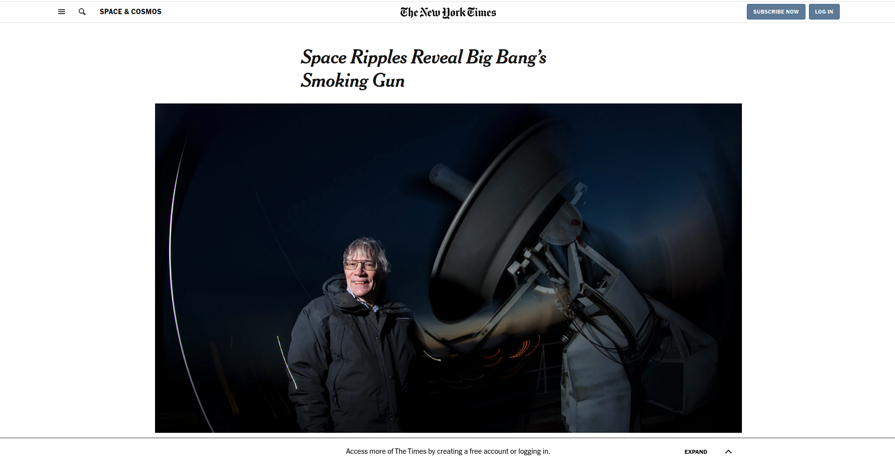

# Clone-New-York-Times 
- using positioning and floating css-properties

### Collaborative project N3

## BUILT WITH

- HTML
- CSS

---

### Live Demo version

[NYT-clone](https://laguna1.github.io/Clone-New-York-Times/)

---

### Autors

👤 **Oksana Petrova**
- Github:[@Laguna1](https://github.com/Laguna1)
- Linkedin: [Oksana Petrova](https://www.linkedin.com/in/oksana-petrova-005bb0145/)
 - Twitter: [Oksana Petrova](https://twitter.com/OksanaP48303303)

👤 **Sheyla Pozo**
- Github:[Sheyla Pozo](https://github.com/sheylaPozo)
- Linkedin: [Sheyla Pozo](https://www.linkedin.com/in/sheypozo/)

🤝 Contributing

Contributions, issues and feature requests are welcome!

Feel free to check the issues page. Show your support

Give a ⭐️ if you like this project! Acknowledgments

Thanks to Microverse for making this possible!
